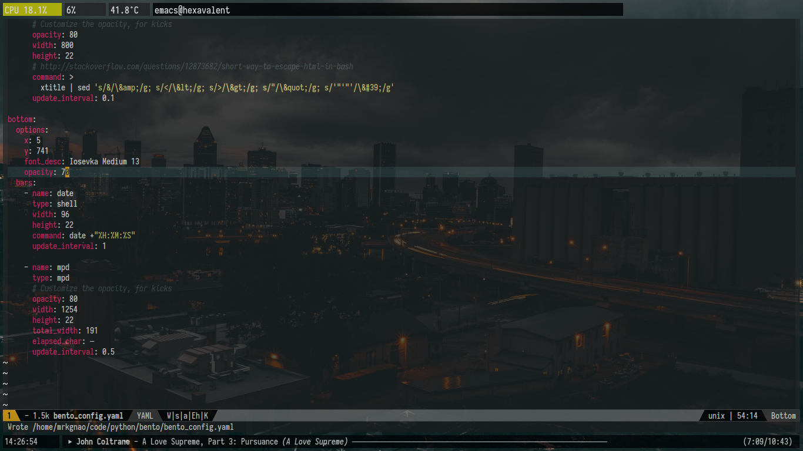

# Bento

A Python interface to [Snackbox](https://github.com/mrkgnao/snackbox) (which makes the bars on the top and the bottom of the screen). 

Currently alpha and significant laundry risk.

Licensed MIT.
